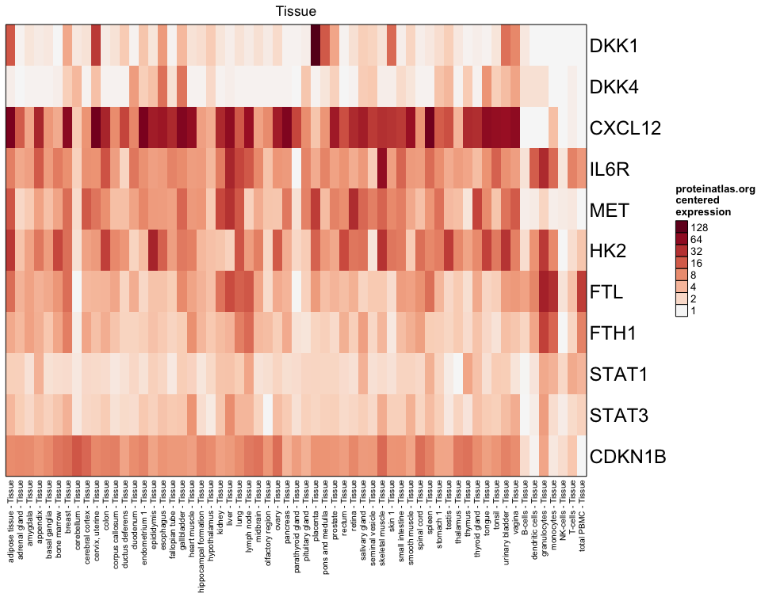
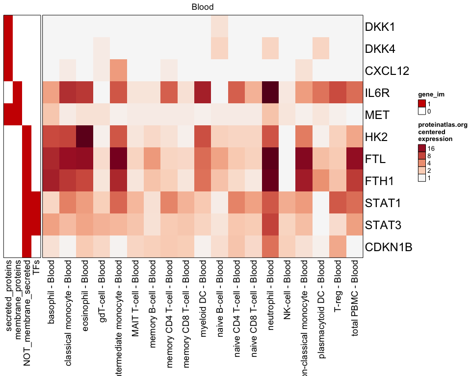
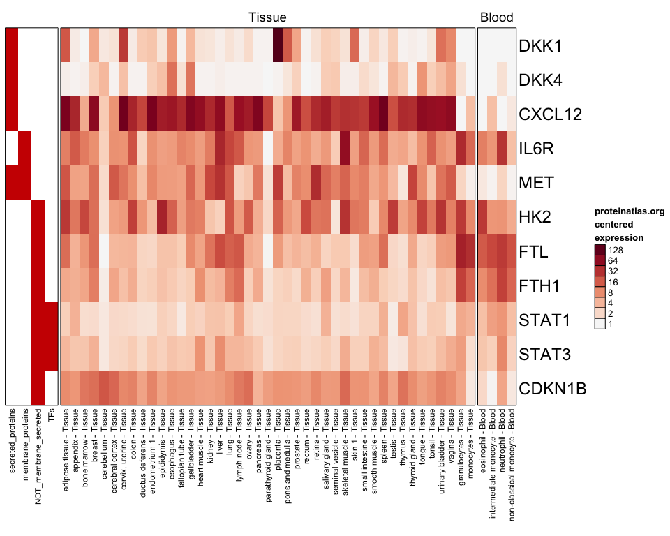
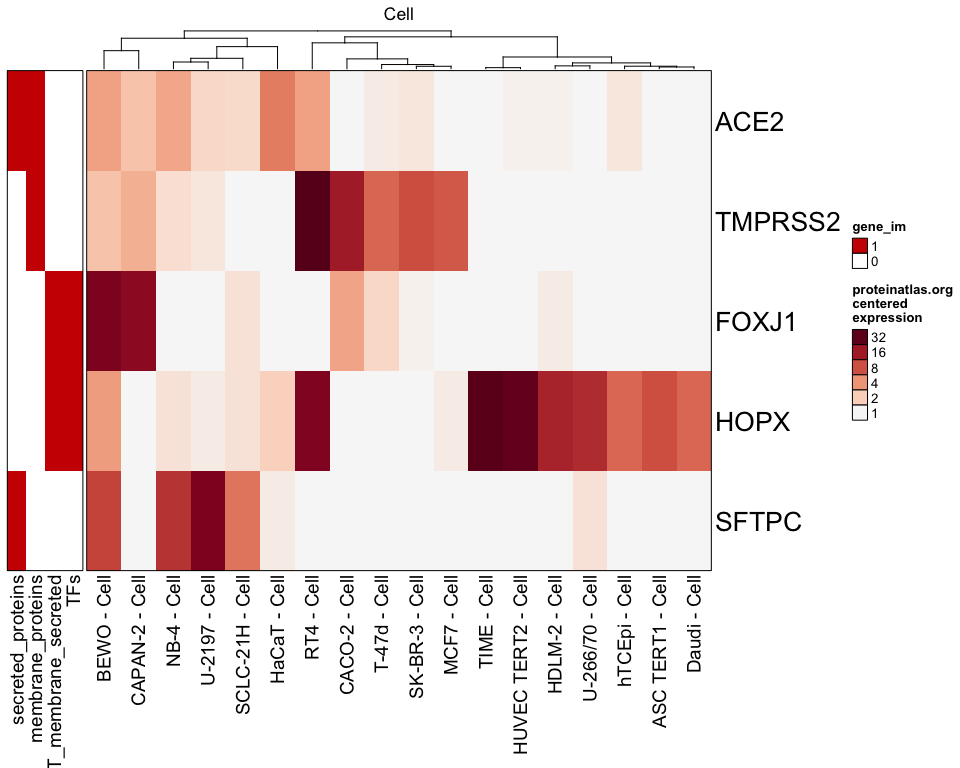

<!-- README.md is generated from README.Rmd. Please edit that file -->

# pajam

<!-- badges: start -->

<!-- badges: end -->

The goal of pajam is to provide data and visualizations from Protein
Atlas, whose data is graciously provided by <https://proteinatlas.org>.

## Installation

You can install `pajam` from [GitHub](https://github.com/) with:

``` r
# install.packages("remotes")
remotes::install_github("jmw86069/pajam")
```

## Package Reference

Online documentation is available via pkgdown:

Full pajam function reference: <https://jmw86069.github.io/pajam>

## Examples

Display protein tissue expression for a set of genes, displaying only
`"Tissue"` sample types:

``` r
library(pajam)

test_genes <- c("DKK1","DKK4","CXCL12","IL6R","MET",
   "HK2","FTL","FTH1","STAT1","STAT3","CDKN1B");
rowGroupMeans <- jamba::rowGroupMeans;
proteinatlas_heatmap(genes=test_genes,
   type="Tissue",
   centered=TRUE);
```



This package includes a few useful genesets that may provide useful
context into the genes. The following example shows `"Blood"` sample
types, and some added annotations.

``` r
# use proteinatlas_genesets_fdb11
use_im <- c("secreted_proteins",
   "membrane_proteins",
   "NOT_membrane_secreted",
   "TFs");
proteinatlas_im <- list2im_opt(proteinatlas_genesets_fdb11[use_im]);
proteinatlas_heatmap(genes=test_genes,
   type="Blood",
   centered=TRUE,
   gene_im=proteinatlas_im);
```



You can filter samples to require a certain minimum expression:

``` r
proteinatlas_heatmap(genes=test_genes,
   type=c("Tissue","Blood"),
   centered=TRUE,
   column_filter=16,
   gene_im=proteinatlas_im);
```



It may be useful in finding cell line expression for a subset of genes:

``` r
proteinatlas_heatmap(genes=c("ACE2", "TMPRSS2", "FOXJ1", "HOPX", "SFTPC"),
   type=c("Cell"),
   centered=TRUE,
   column_filter=4,
   cluster_columns=TRUE,
   gene_im=proteinatlas_im);
```



## R-shiny app

You can start an R-shiny app that includes a heatmap that can be zoomed
(thanks to the `ComplexHeatmap` package\!):

``` r
## not run
#launch_pajam();

# Or define custom starting genes
selected_genes <- c("DKK1","DKK4","CXCL12","IL6R","MET",
   "HK2","FTL","FTH1","STAT1","STAT3","CDKN1B");
#launch_pajam();
```
